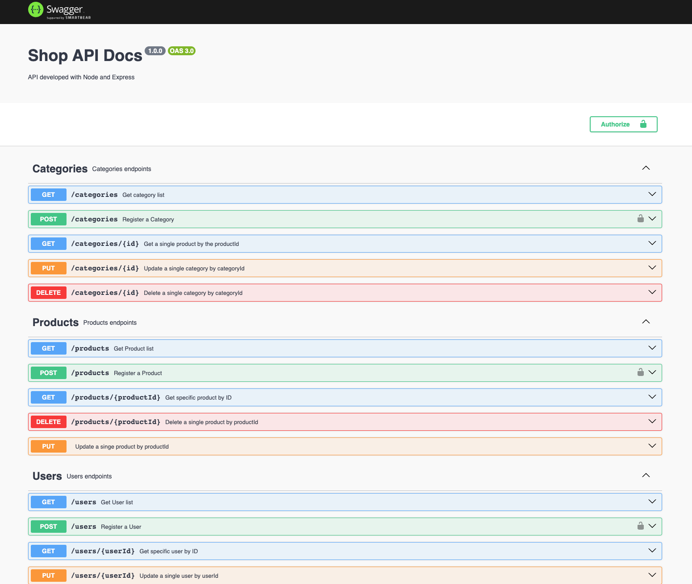

# Shop API

## Techonologies used:

- Javascript
- Typescript
- Node js
- Express
- Express-validator
- Mongoose
- MongoDB

## Swagger docs

## Available Scripts

In this project directory, you can run:

### `npm i`

Install node modules

### `npm run dev`

Run nodemon in port 3002
